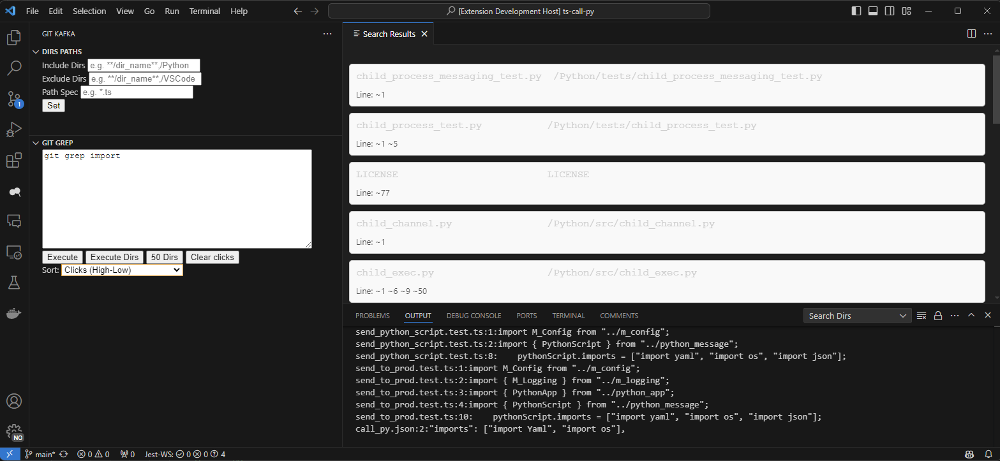

# vscode-git-kafka

Visual Studio Code extension to invoke git commands and scale with kafka

Git is great version control system with good commands in scripts. Visual Studio extension to publish commands results in windows UI and integrate multiple git instances with Kafka.

